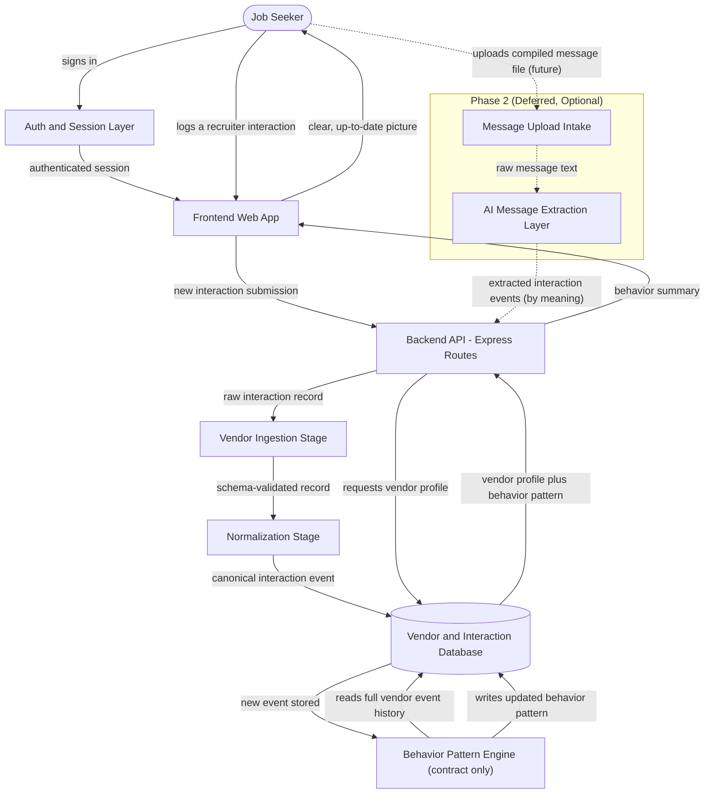

# Architecture: VendorIQ

## The Idea

VendorIQ is a web app that helps job seekers track vendor, agency, and recruiter behavior so they can make better decisions during the job search. It's designed for people who interact with multiple recruiters and want a clear, trustworthy picture of how each one behaves over time. In the future, users may optionally allow VendorIQ to organize recruiter messages or upload a compiled message file for aggregation, but on day one the system must reliably capture and display recruiter behavior patterns in a simple, easy‑to‑understand format. Every component in the system exists to guarantee that this behavior tracking is accurate, clear, and always up to date.

**The day-one guarantee sentence** ("the system must reliably capture and display recruiter behavior patterns... accurate, clear, and always up to date") is what every component below is judged against. The **Behavior Pattern Engine** exists specifically to guarantee it: it is the one component whose entire job is turning raw logged events into an always-current, accurate picture.

## Note on scope: proprietary methodology

This repo already has an approved foundation scaffold for VendorIQ (`backend/src/services/vendorIngestion/`, `directives/vendor_ingestion_stage.md`), which explicitly excludes "VendorIQ scoring or trade-secret methodology" from any implementation artifact. This architecture follows that same boundary: the **Behavior Pattern Engine** is specified as a contract (what goes in, what comes out) — its internal scoring formulas are intentionally not designed or disclosed here.

## Components

| Component | What it does for VendorIQ | Words that required it |
|---|---|---|
| **Frontend Web App** | The screen a job seeker uses to log an interaction with a recruiter and see that recruiter's behavior history in plain language. | "web app," "display ... in a simple, easy-to-understand format" |
| **Auth & Session Layer** | Makes sure each job seeker only ever sees and edits their own tracked recruiters — nobody else's. | "job seekers" (individual users tracking their own picture) |
| **Backend API (Express Routes)** | The front door for every request — routes a new interaction to be saved, or a dashboard request to be answered. | "capture and display" (the two operations every request is one of) |
| **Vendor Ingestion Stage** *(existing scaffold, reused)* | Checks that a new interaction record is well-formed before anything else touches it, so bad data never corrupts a vendor's history. | "reliably capture," and reuses the already-approved `vendor_ingestion_stage` in this repo |
| **Normalization Stage** | Converts every accepted interaction — however it arrived — into one consistent internal shape, so the Behavior Pattern Engine never has to special-case its inputs. | "clear, trustworthy picture" (one picture requires one consistent shape, especially once Phase 2 adds a second input path) |
| **Behavior Pattern Engine** *(contract only — see scope note above)* | Recomputes a vendor's behavior pattern from their complete interaction history every time a new event lands, so what's displayed is never stale. | "accurate, clear, and always up to date," "how each one behaves over time" — this is the component named by the day-one guarantee sentence |
| **Vendor & Interaction Database** | Keeps a permanent record of every recruiter, every logged interaction, and each vendor's current computed pattern, so nothing is lost between visits. | "track ... over time" (state that must outlive a single session) |
| **Message Upload Intake** *(Phase 2, deferred)* | Lets a job seeker optionally hand VendorIQ a compiled file of recruiter messages instead of logging interactions one at a time. | "upload a compiled message file for aggregation" |
| **AI Message Extraction Layer** *(Phase 2, deferred)* | Reads the uploaded messages and pulls out structured interaction events by understanding what each message means, then feeds them through the same ingestion path as manual entries. | "organize recruiter messages ... for aggregation" — extraction by meaning is an AI-shaped task, and the paragraph marks it explicitly as future/optional |

No third-party service is required for the day-one system — the paragraph describes manual capture and internal display only. No queue is required — nothing described is bursty or slow; the one plausibly slow operation (AI message extraction) is itself deferred to Phase 2, at which point a queue may become relevant but is not designed here.

## Diagram

## How Data Flows

A job seeker signs in through the Auth & Session Layer, which hands the Frontend Web App an authenticated session scoped to that person's own data. When they log a recruiter interaction, the Frontend sends it to the Backend API, which passes it to the Vendor Ingestion Stage for schema validation — malformed submissions are rejected here with a structured, field-level reason, never silently dropped. A validated record moves to the Normalization Stage, which reshapes it into the one canonical event format the rest of the system understands, and that canonical event is persisted in the Vendor & Interaction Database. Storing a new event triggers the Behavior Pattern Engine, which reads that vendor's entire interaction history and writes back an updated behavior pattern — this recompute-on-write step is what keeps the picture "always up to date" rather than showing a stale snapshot. When the job seeker views their dashboard, the Backend API reads the vendor's profile and current behavior pattern from the database and returns it to the Frontend, which renders it in plain language. The Phase 2 path (dashed in the diagram) is optional and deferred: a job seeker may later upload a compiled message file, which the Message Upload Intake hands to the AI Message Extraction Layer; that layer parses the messages into structured interaction events and submits them through the same Backend API → Ingestion → Normalization path used by manual entries, so nothing downstream needs to know how an event arrived.

## Build Order

| Phase | Builds | Proves |
|---|---|---|
| **Phase 1 — Core Capture** | Auth & Session Layer, Backend API, Vendor Ingestion Stage, Frontend logging form | A job seeker can create an account and log a recruiter interaction that persists correctly and is rejected cleanly when malformed. |
| **Phase 2 — Behavior Pattern Engine** | Normalization Stage, Behavior Pattern Engine (contract: defined inputs/outputs, internal logic out of scope) | Logged events reliably turn into an accurate, current behavior pattern — the day-one guarantee sentence, satisfied end to end. |
| **Phase 3 — Trustworthy Display** | Dashboard views, per-vendor history, comparison view | The computed pattern reads as a simple, clear, trustworthy picture to a non-technical job seeker, not a raw data dump. |
| **Phase 4 — Deferred Message Aggregation** | Message Upload Intake, AI Message Extraction Layer | Optional automated ingestion produces interaction events of the same quality as manual entry, without changing anything downstream. |

Phase 3 gates the day-one release; Phase 4 is explicitly optional per the paragraph ("may optionally allow") and is not required to ship the day-one system.

## Assumptions

| Assumption | Impact if wrong |
|---|---|
| Job seekers manually log interactions on day one; there is no inbox/API integration yet. | The system's accuracy is bounded by what users diligently log. Since the AI extraction path is deferred, this keeps day-one scope small and auditable — but the tradeoff is explicit and known, not hidden. |
| "Behavior pattern" means a set of metrics computed from discrete event types (e.g., contacted, responded, scheduled, ghosted, rejected, offered). | If the real metric set differs, only the Behavior Pattern Engine's contract (its input event vocabulary) needs revision — the rest of the architecture is unaffected. |
| The Behavior Pattern Engine's internal scoring methodology is proprietary, per this repo's existing convention (`backend/src/services/vendorIngestion/README.md` explicitly excludes "VendorIQ scoring or trade-secret methodology"). | This document defines the engine's contract only. If that convention changes, a separate, access-controlled design pass is needed for the actual scoring logic — not a change to this architecture. |
| Each job seeker's tracked data is private to them; there is no cross-user or crowdsourced vendor reputation pool on day one. | If crowdsourcing is wanted later, that's a compliance/privacy-relevant redesign (per CLAUDE.md, a governance-boundary decision requiring escalation), not an incremental addition. |
| "Web app" means a responsive browser app, not a native mobile app. | Build targets are web-only; no app-store distribution, push notifications, or offline-mobile design is assumed. |

## What This Design Does Not Cover

- **Cross-user or crowdsourced recruiter reputation** — this design only covers an individual job seeker's private view of vendors they've personally interacted with, not a shared "how does this recruiter treat everyone" pool.
- **The Behavior Pattern Engine's actual scoring formulas** — deliberately excluded; see the scope note above.
- **Phase 2's exact extraction mechanics** — which NLP approach, which message sources (email export, LinkedIn export, plain paste), and what accuracy guarantee the AI Message Extraction Layer offers are all open questions, not designed here.
- **Notifications or alerts** (e.g., "this recruiter has gone quiet for two weeks") — not mentioned in the source paragraph, not included.
- **Monetization, admin tooling, or multi-org/enterprise features** — out of scope; the paragraph describes an individual job seeker's tool.
